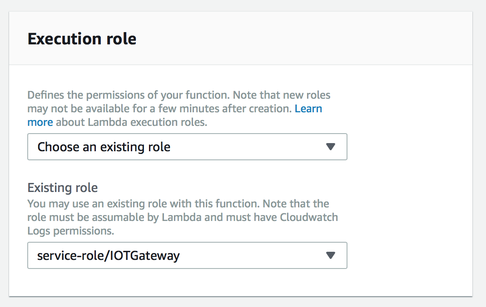

# IFTTT to AWS (POST Request)
How to send information from a 3rd party app to your AWS account using IFTTT webhooks. 

# Background 
IFTTT is a service which allows you to connect any two IFTTT registered apps (called IFTTT services) together.
Webhooks in an IFTTT service to send a receive HTTP requests to a destination of your choice (endpoint). 

https://ifttt.com/maker_webhooks

The following example shows you how to send a HTTP POST request to your AWS account at specific times everyday, and print this information to console. 
The setup involves the following steps: 

1. AWS Lambda Development 
2. AWS RESTful API Development 
3. IFTTT Setup 

# 1. AWS Lambda
- Open the AWS Lambda console under your account
- Copy the code 'HTTP_POST_Simple' , into the Lambda console. 
- Make sure the console is setup to use Node.js. 
- Change the IAM Permissions to allow API Gateway to communicate with AWS Lambda. The settings can be found at the bottom of the Lambda console:

- The code can be tested using the 'Test' tab in API Gateway or AWS Lambda 

# 2. AWS RESTful API Development 
- Open the AWS API Gateway console in your AWS account, and click the 'create api' button

- Setup the API as below and click save 

- A new window will open as below. Select the 'Action' button, and press 'Create Resource':

- Enter a name for the resource and click 'Create Resource'. Do not check any of the boxes on this page: 

- Back on the main page, click the 'Action' button again and select 'Create Method': 

- Choose 'Post' as the method type, and setup the method as below. 
- The RESTful API setup in this example uses AWS API Gateway 'proxy' settings 
- This means the JSON file received from IFTTT is sent to AWS Lambda as it was received by the gateway. (i.e. with no changes made to the file) 
- Be sure to check this box in the settings: 

# 3. IFTTT Setup
See Instructions on how to create IFTTT Applets

https://help.ifttt.com/hc/en-us/articles/115010361388-How-do-I-create-an-Applet-

In this case we will use the Date+Time service as the trigger ('IF this'):

Select the Webhooks service as the action ('THEN that'):

- **'URL'**: The endpoint of your AWS API Gateway received above. 
- **Method Type** : The HTTP method type we are using in this example is POST
- **Content Type**: If you wish to add information from the trigger (i.e. Date+Time service), or add your own JSON code, then select 'application/json'. 
- **'Body'** will contain the JSON file you wish to send to AWS. If you want to send data from the 3rd party app instead, then select *'add ingredient'* button. 

