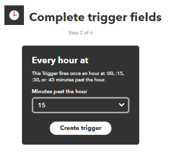
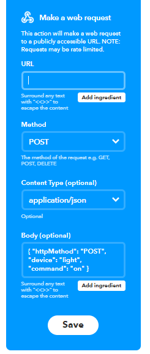

# IFTTT to AWS (POST Request)
How to send information from a 3rd party app to your AWS account using IFTTT webhooks. 

# Background 
IFTTT is a service which allows you to connect any two IFTTT registered apps (called IFTTT services) together.
Webhooks in an IFTTT service to send a receive HTTP requests to a destination of your choice (endpoint). 

https://ifttt.com/maker_webhooks

The following example shows you how to send a HTTP POST request to your AWS account at specific times everyday, and print this information to console. 
The setup involves the following steps: 

1. AWS RESTful API Development 
2. AWS Lambda Development 
3. IFTTT Setup 

# 1. AWS RESTful API Development 

# 2. AWS Lambda
 
# 3. IFTTT Setup
See Instructions on how to create IFTTT Applets

https://help.ifttt.com/hc/en-us/articles/115010361388-How-do-I-create-an-Applet-

In this case we will use the Date+Time service as the trigger ('IF this'):

Select the Webhooks service as the action ('THEN that'):

- **'URL'**: The endpoint of your AWS API Gateway received above. The type of HTTP request we are using is 'POST'.
- **Method Type** : The HTTP method type we are using in this example is POST
- **Content Type**: If you wish to add information from the trigger (i.e. Date+Time service), or add your own JSON code, then select 'application/json'. 
- **'Body'** will contain the JSON file you wish to send to AWS. If you want to send data from the 3rd party app instead, then select *'add ingredient'* button. 

